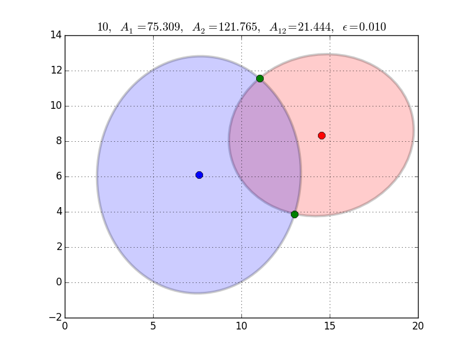

[](https://raw.githubusercontent.com/chraibi/EEOver/master/LICENSE)  [](https://zenodo.org/badge/latestdoi/13856870)


## Ellipse-Ellipse overlap area:
This program calculates the overlapping area of two arbitrary ellipses. It implements
the algorithm published in this [paper](http://link.springer.com/article/10.1007%2Fs00791-013-0214-3). See also the available [preprint](http://arxiv.org/abs/1106.3787). 



### Usage: 
- compile the code:
```
make
````

  This should produce an executable (`overlap`)
- run the executable with an input-file and an id:

```
./overlap inputfile id
```

(`id` is 1 or 2 to choose between two different quartic solvers)
- This should produce two output-files:
- **result-File**: `results.txt`

- **root-File**: `roots.txt`

### Contents and Formats of files: 
- the **input-File** should be in the following format

```
id A1 B1 H1 K1 PHI_1 A2 B2 H2 K2 PHI_2
```

**(11 columns)**

  - `id` is a running number
  - `Ax`  and
  - `Bx` are semi-axes of the one ellipse with the center coordinates 
  - `(Hx, Kx)` 
  - and the inclination with respect to the x-axis `Phi_x` _(x in {1, 2})_

- **results-File** is in the following format: 

```
id area-Ellipse1 (=pi.A1.B1) areaEllipse2 (=pi.A2.B2) OverlapAreaAnalytical OverlapAreaPolynomial rel_err
```

- **roots-File** contains the coordinates of the intersection points (if any):

```
id x0 y0 x1 y1 x2 y2 ...
```

this file is used by the [plot-script](plot.py)

### How to visualize the results: 
```
python plot.py inputFile rootsFile resultsFile
```

That would produce in the directory **./cases/** a couple of  png's

### Requirements:
- > [GSL](http://www.gnu.org/software/gsl/): to solve the quartic equations 
- _(optional)_ > [Boost.polygon](http://www.boost.org/doc/libs/1_54_0/libs/polygon/doc/index.htm): to compare the results of this code, 
the overlap-area of polygonized ellipses is calculated with Boost.polygon. In case you don't have `boost` installed (and don't want to)
then you need to set `USING_BOOST` in [call_ee.cpp](call_ee.cpp) to 0

```
#define USING_BOOST 0
```

### Remarks:

The solver of the quartic function is the central part of the code. Actually, two different solvers are used separately: 
- [gsl_poly_complex_solve()](http://linux.math.tifr.res.in/manuals/html/gsl-ref-html/gsl-ref_6.html) from GSL,
- and [gsl_poly_complex_solve_quartic()](http://www.network-theory.co.uk/download/gslextras/Quartic/00README.txt) from Andrew Steiner.          

The second one is faster, however fails to calculate accurately the roots of [test_5](test5.txt).

### To do:
- [ ] Implement the algorithm from the paper [The fast quartic solver](http://www.sciencedirect.com/science/article/pii/S0377042710002128) by Peter Strobach.
- [ ] Try [MPSolve](http://numpi.dm.unipi.it/mpsolve-2.2/doc.htm). This library adds some dependencies though.
- [ ] Add more tests to cover all the cases.
